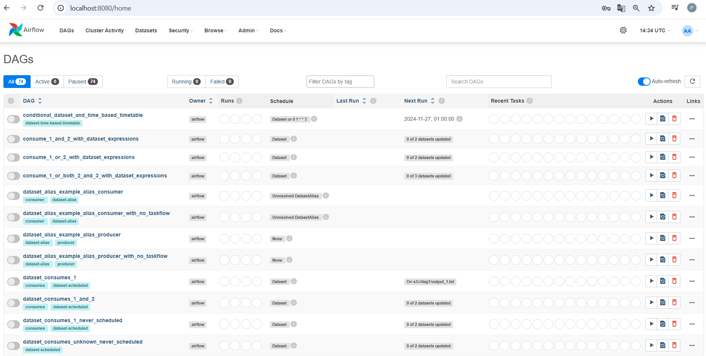
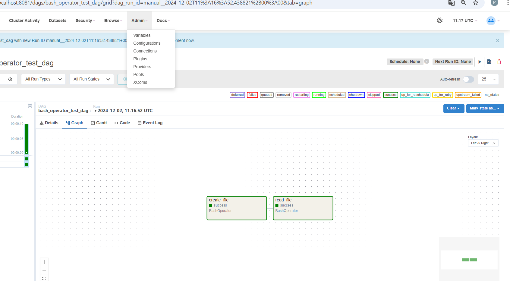

# Apache Airflow com Docker

Este repositório contém os arquivos necessários para configurar e executar o Apache Airflow utilizando Docker e Docker Compose.

# Pré-requisitos

Antes de começar, certifique-se de ter instalado:

Docker (versão 20.10 ou superior)
Docker Compose (versão 1.29 ou superior)
Git (opcional, para clonar este repositório)
Passos para executar o Apache Airflow com Docker

1. Clone o repositório
bash
Copiar código
git clone https://github.com/seu_usuario/seu_repositorio.git
cd seu_repositorio
2. Configure as variáveis de ambiente
Crie um arquivo .env na raiz do projeto (opcional) para definir configurações como AIRFLOW_UID:

bash
```
echo -e "AIRFLOW_UID=$(id -u)" > .env
```
Isso é necessário em sistemas Linux para evitar problemas de permissão.

3. Inicialize o ambiente do Airflow
Execute o comando para inicializar o ambiente:

bash
```
docker-compose up airflow-init
```

Esse comando irá:

Criar o banco de dados do Airflow.
Inicializar as tabelas necessárias.
Configurar o usuário administrador padrão (se configurado).
4. Suba os serviços do Airflow
Inicie os serviços com o comando:

bash

```
docker-compose up
```

Os seguintes serviços serão inicializados:

PostgreSQL: Banco de dados para armazenar metadados do Airflow.
Redis: Usado como broker para o Celery.
Airflow Webserver: Interface gráfica do Airflow.
Airflow Scheduler: Responsável por agendar DAGs.
Airflow Worker: Executa tarefas em DAGs.
Airflow Triggerer: Lida com eventos baseados em triggers.
5. Acesse a interface do Airflow
Abra o navegador e acesse:

arduino
```
http://localhost:8080
```
Use as credenciais padrão para login (se configuradas):

Usuário: airflow
Senha: airflow
6. Adicione suas DAGs
Coloque seus arquivos de DAG na pasta dags/. Eles serão automaticamente detectados pelo Airflow.

Comandos úteis
Parar os serviços:

bash
```
docker-compose down
```
Reiniciar os serviços:

bash
```
docker-compose restart
```
Verificar os logs de um serviço específico:

bash
```
docker-compose logs <nome-do-serviço>
```
Exemplo:

bash
```
docker-compose logs airflow-webserver
```
Remover todos os containers e volumes (limpeza completa):

bash
```
docker-compose down --volumes --remove-orphans
```

Imagem abaixo da tela do AIRFLOW





